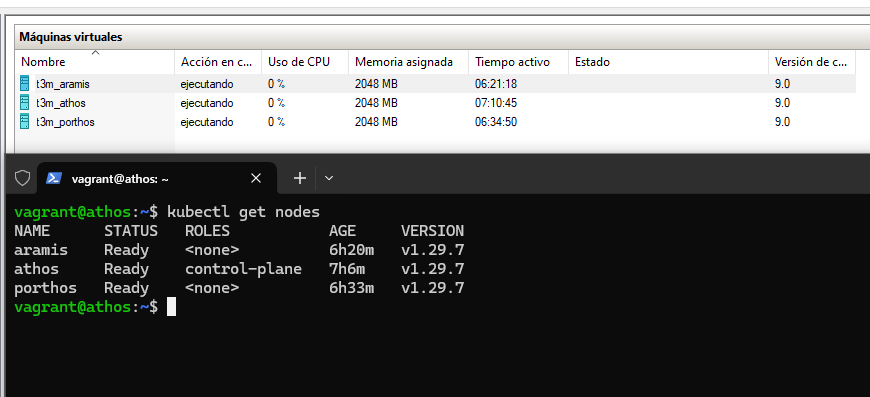

 

# K8S lab on Hyper-V

The idea of this project is to create an easy to deploy Kubernetes environment where different scenarios can be installed to practice Red Team or Pentesting engagements.



Ansible playbooks used to provision K8S were adapted from [torgeirl/kubernetes-playbooks](https://github.com/torgeirl/kubernetes-playbooks).

> [!NOTE]
> No ingress controller is installed in the base lab since some of the scenarios install specific versions of these components.

## Pre-requisites

The next steps should be executed with Powerhell unless indicated otherwise:

1. Enable Hyper-V as administrator:
   ```powershell
   Enable-WindowsOptionalFeature -Online -FeatureName Microsoft-Hyper-V-All
   Enable-WindowsOptionalFeature -Online -FeatureName HypervisorPlatform
   Enable-WindowsOptionalFeature -Online -FeatureName VirtualMachinePlatform
   ```
2. Install Windows Subsystem for Linux (WSL) as administrator:
   ```powershell
   wsl --install -d ubuntu # You will need to open the Ubuntu application after this command to complete the installation
   wsl --set-version ubuntu 1
   ```
3. Add this to `/etc/wsl.conf` (Inside WSL):
   ```
   ...
   [automount]
   enabled = true
   root = /mnt/
   options = "metadata,umask=77,fmask=11"
   mountFsTab = false
   ```
4. Now restart `LxssManager` as administrator:
   ```powershell
   Restart-Service -Name "LxssManager"
   ```
5. Install Vagrant (Inside WSL):
   ```bash
   echo 'export VAGRANT_WSL_ENABLE_WINDOWS_ACCESS="1"' >> ~/.bashrc
   echo 'export VAGRANT_DEFAULT_PROVIDER=hyperv' >> ~/.bashrc
   source ~/.bashrc
   wget -O- https://apt.releases.hashicorp.com/gpg | gpg --dearmor | sudo tee /usr/share/keyrings/hashicorp-archive-keyring.gpg
   echo "deb [signed-by=/usr/share/keyrings/hashicorp-archive-keyring.gpg] https://apt.releases.hashicorp.com $(lsb_release -cs) main" | sudo tee /etc/apt/sources.list.d/hashicorp.list
   sudo apt update && sudo apt install vagrant -y
   ```
6. Install this Vagrant plugin (Inside WSL):
   ```bash
   # If vagrant gives you an error, try to reboot and try again
   vagrant plugin install vagrant-reload
   ```
7. Install Ansible (Inside WSL):
   ```bash
   sudo apt install python3-pip -y
   echo 'PATH=~/.local/bin:$PATH' >> ~/.bashrc
   source ~/.bashrc
   pip3 install ansible
   ```

## Choosing Kubernetes version

You can tweak what Kubernetes version is gonna be installed by changing the variable `kubernetes_version` in the file `ansible/group_vars/all.yaml`.

## Deploy

Vagrant is gonna start three Ubuntu machines alongside a NAT switch called T3MSwitch:
- Master node: t3m_athos (10.10.20.2).
- Worker node 1: t3m_porthos (10.10.20.3).
- Worker node 2: t3m_aramis (10.10.20.4).

Put the repository directory anywhere **outside** WSL, for some reason Vagrant hates to be launched in WSL directories. Also, make sure the WSL console is run as administrator:
```bash
# If you don't have the switch called 'Default Switch', replace that name from the Vagrantfile and use any other switch with a DHCP server attached
vagrant up
```

In order to check the cluster status, connect to `t3m_athos` (Through Hyper-V GUI or SSH) and login with the credentials `vagrant:vagrant`. Now execute this:
```bash
kubectl get nodes
```
You can connect to any of the other nodes too using the same credentials.

The command result should be something like:
```
vagrant@athos:~$ kubectl get nodes
NAME      STATUS   ROLES           AGE     VERSION
aramis    Ready    <none>          2m12s   v1.29.4
athos     Ready    control-plane   146m    v1.29.4
porthos   Ready    <none>          20m     v1.29.4
```

## Scenarios

The scenarios are installed/uninstalled using Ansible playbooks, visit the [scenarios/](scenarios/) directory to check the available scenarios and learn more about how to use the playbooks provided.

## Clean up

If you want to just get rid of everything execute these commands. They should be executed with Powerhell unless indicated otherwise:

1. Remove lab (Inside WSL as administrator):
   ```bash
   vagrant destroy -f
   ```
2. Uninstall WSL as administrator:
   ```powershell
   wsl --unregister ubuntu
   # Now, go ahead and uninstall Ubuntu from the Windows program list
   Disable-WindowsOptionalFeature -Online -FeatureName Microsoft-Windows-Subsystem-Linux
   ```  
3. Uninstall Hyper-V as administrator:
   ```powershell
   Disable-WindowsOptionalFeature -Online -FeatureName Microsoft-Hyper-V-All
   Disable-WindowsOptionalFeature -Online -FeatureName HypervisorPlatform
   Disable-WindowsOptionalFeature -Online -FeatureName VirtualMachinePlatform
   ```
